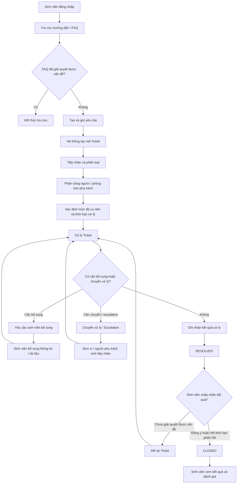

# Tổng Quan Nghiệp Vụ Hỗ Trợ Sinh Viên (Domain Overview)

## 1. Bối Cảnh Nghiệp Vụ

Tại **Aurora University**, các yêu cầu hỗ trợ sinh viên hiện được tiếp nhận và xử lý qua nhiều kênh khác nhau. Điều này làm cho thông tin dễ bị phân tán, khó theo dõi trách nhiệm xử lý và khó tổng hợp dữ liệu phục vụ quản lý.

UniSupport chuẩn hóa quy trình này bằng cách đưa các yêu cầu hỗ trợ về một đầu mối chung dưới dạng **Ticket**. Mỗi Ticket được theo dõi xuyên suốt từ khi sinh viên gửi yêu cầu, được phân loại và giao xử lý, cho đến khi có kết quả, đóng yêu cầu và ghi nhận phản hồi.

Miền nghiệp vụ của UniSupport xoay quanh ba nhóm người dùng chính:

- **Sinh viên (Student):** gửi yêu cầu, theo dõi tiến độ, bổ sung thông tin, nhận kết quả và đánh giá mức độ hài lòng.
- **Nhân viên (Staff):** tiếp nhận, phân loại, phân công/xử lý, cập nhật trạng thái, yêu cầu bổ sung, chuyển xử lý, escalation và hoàn tất Ticket.
- **Quản lý (Management):** giám sát tình hình xử lý, theo dõi khối lượng công việc và thời hạn, xem báo cáo, đồng thời thực hiện các chức năng quản trị được phân quyền.

---

## 2. Các Khái Niệm Nghiệp Vụ Cốt Lõi

Các khái niệm chính được sử dụng xuyên suốt UniSupport gồm:

- **Ticket:** đại diện cho một yêu cầu hỗ trợ của sinh viên.
- **Mã Ticket:** mã định danh duy nhất để tra cứu và theo dõi yêu cầu.
- **Nhóm vấn đề (Category):** dùng để phân loại nội dung yêu cầu và hỗ trợ điều phối xử lý.
- **Phòng ban (Department):** đơn vị chịu trách nhiệm xử lý Ticket.
- **Người phụ trách (Assignee):** nhân viên được giao trách nhiệm xử lý Ticket.
- **Mức độ ưu tiên (Priority):** thể hiện mức độ cần ưu tiên của Ticket.
- **Thời hạn xử lý:** mốc thời gian dùng để theo dõi tiến độ và nhận biết Ticket sắp hoặc đã quá hạn.
- **Lịch sử xử lý:** tập hợp các thay đổi và hoạt động quan trọng phát sinh trong quá trình xử lý Ticket.
- **Kết quả xử lý (Resolution):** nội dung hoặc tài liệu phản hồi sau khi yêu cầu được xử lý.
- **Đánh giá hài lòng (CSAT):** phản hồi của sinh viên về chất lượng hỗ trợ sau khi yêu cầu được giải quyết.

---

## 3. Nguyên Tắc Nghiệp Vụ Chung

UniSupport áp dụng các nguyên tắc chung sau cho toàn bộ vòng đời Ticket:

1. **Định danh rõ ràng:** Mỗi yêu cầu được tạo thành một Ticket và có mã Ticket duy nhất để tra cứu.
2. **Trách nhiệm xử lý rõ ràng:** Ticket phải xác định được phòng ban phụ trách và, khi được phân công, người chịu trách nhiệm xử lý.
3. **Phân loại và ưu tiên thống nhất:** Ticket được phân loại theo nhóm vấn đề và xác định mức độ ưu tiên để hỗ trợ điều phối công việc.
4. **Theo dõi được tiến độ:** Trạng thái, thời hạn xử lý và các hoạt động quan trọng của Ticket phải được ghi nhận xuyên suốt quá trình xử lý.
5. **Hỗ trợ chuyển xử lý và escalation:** Ticket có thể được chuyển sang người/phòng ban phù hợp hoặc escalation khi cần thiết mà vẫn giữ được lịch sử xử lý.
6. **Bổ sung thông tin có kiểm soát:** Nhân viên có thể yêu cầu sinh viên bổ sung thông tin hoặc tài liệu trước khi tiếp tục xử lý.
7. **Kết quả và phản hồi được lưu vết:** Kết quả xử lý, việc đóng/mở lại Ticket và đánh giá hài lòng được ghi nhận để phục vụ theo dõi và báo cáo.
8. **Truy cập theo quyền:** Người dùng chỉ được xem và thao tác trên dữ liệu phù hợp với vai trò và phạm vi trách nhiệm của mình.

---

## 4. Luồng Nghiệp Vụ Tổng Quan

Trạng thái **RESOLVED** được sử dụng khi Ticket đã có kết quả xử lý nhưng vẫn còn trong thời hạn phản hồi của sinh viên. Trong thời hạn này, nếu sinh viên xác nhận vấn đề chưa được giải quyết, Ticket được mở lại và quay về trạng thái xử lý. Nếu sinh viên chấp nhận kết quả hoặc hết thời hạn phản hồi, Ticket chuyển sang trạng thái **CLOSED** và kết thúc vòng đời xử lý.

Dữ liệu Ticket được tổng hợp phục vụ Dashboard và báo cáo quản lý, bao gồm trạng thái xử lý, Ticket sắp hoặc đã quá hạn, khối lượng công việc, thời gian xử lý và mức độ hài lòng của sinh viên.
