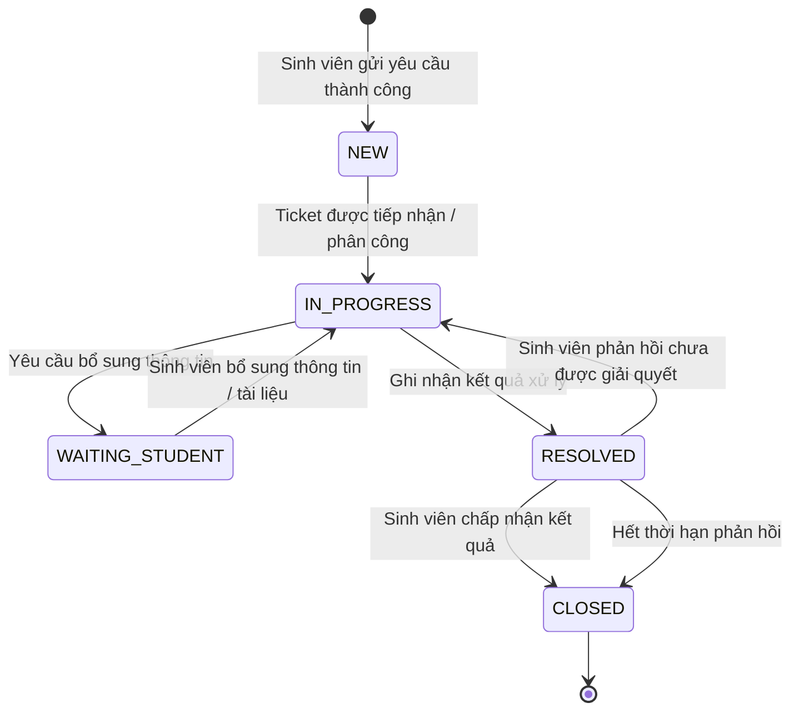

# Vòng Đời Ticket (Ticket Lifecycle)

Vòng đời Ticket quy định các giai đoạn xử lý mà một yêu cầu hỗ trợ đi qua từ thời điểm được tạo đến khi kết thúc. Mỗi giai đoạn phản ánh trạng thái nghiệp vụ của Ticket và xác định các hành động được phép thực hiện tại thời điểm tương ứng.

## 1. Các Trạng Thái Trong Vòng Đời

UniSupport sử dụng các trạng thái nghiệp vụ chính sau:

| Trạng thái | Ý nghĩa |
| :--- | :--- |
| `NEW` | Ticket đã được tạo thành công và đang chờ tiếp nhận/phân công xử lý. |
| `IN_PROGRESS` | Ticket đang được nhân viên hoặc phòng ban phụ trách xử lý. |
| `WAITING_STUDENT` | Quá trình xử lý đang chờ sinh viên bổ sung thông tin hoặc tài liệu cần thiết. |
| `RESOLVED` | Ticket đã có kết quả xử lý và đang trong thời hạn để sinh viên xem, phản hồi hoặc xác nhận kết quả. |
| `CLOSED` | Ticket đã kết thúc vòng đời xử lý sau khi kết quả được chấp nhận hoặc hết thời hạn phản hồi. |

---

## 2. Sơ Đồ Vòng Đời Ticket

Việc chuyển Ticket sang người phụ trách hoặc phòng ban khác, cũng như escalation, không tạo ra trạng thái vòng đời riêng. Các hành động này làm thay đổi trách nhiệm xử lý nhưng Ticket tiếp tục ở trạng thái nghiệp vụ phù hợp với quá trình xử lý hiện tại.

---

## 3. Chi Tiết Các Giai Đoạn

### 3.1 NEW — Yêu cầu mới

**Điều kiện bắt đầu:** Sinh viên gửi yêu cầu hợp lệ và hệ thống tạo Ticket thành công.

**Đặc điểm nghiệp vụ:**
- Hệ thống tạo mã Ticket duy nhất.
- Ticket được ghi nhận vào hệ thống và xác định nhóm vấn đề/phòng ban tiếp nhận theo thông tin yêu cầu.
- Ticket có thể chưa có người phụ trách cụ thể.
- Ticket chờ được tiếp nhận, phân loại và phân công xử lý.

**Kết thúc giai đoạn:** Ticket được tiếp nhận hoặc phân công để bắt đầu xử lý.

---

### 3.2 IN_PROGRESS — Đang xử lý

**Điều kiện bắt đầu:** Ticket đã được tiếp nhận hoặc phân công cho phạm vi xử lý phù hợp.

**Đặc điểm nghiệp vụ:**
- Nhân viên thực hiện xử lý yêu cầu và cập nhật tiến độ.
- Mức độ ưu tiên và thời hạn xử lý được áp dụng theo quy tắc nghiệp vụ.
- Ticket có thể được phân công lại, chuyển người/phòng ban xử lý hoặc escalation khi cần thiết.
- Mọi thay đổi quan trọng phải được ghi nhận trong lịch sử xử lý.
- Nếu cần thêm thông tin hoặc tài liệu từ sinh viên, Ticket chuyển sang `WAITING_STUDENT`.
- Khi đã có kết quả xử lý, Ticket chuyển sang `RESOLVED`.

---

### 3.3 WAITING_STUDENT — Chờ sinh viên bổ sung

**Điều kiện bắt đầu:** Nhân viên yêu cầu sinh viên bổ sung thông tin hoặc tài liệu cần thiết để tiếp tục xử lý.

**Đặc điểm nghiệp vụ:**
- Hệ thống ghi nhận nội dung yêu cầu bổ sung và thông báo cho sinh viên.
- Ticket tạm thời chờ phản hồi từ sinh viên.
- Cách tính thời hạn xử lý trong thời gian chờ được áp dụng theo quy tắc tại `business-rules.md`.

**Kết thúc giai đoạn:** Khi sinh viên gửi thông tin hoặc tài liệu bổ sung hợp lệ, Ticket quay lại `IN_PROGRESS`.

---

### 3.4 RESOLVED — Đã có kết quả xử lý

**Điều kiện bắt đầu:** Nhân viên hoàn tất phần xử lý nghiệp vụ và ghi nhận kết quả cho Ticket.

**Đặc điểm nghiệp vụ:**
- Kết quả xử lý được lưu vào Ticket.
- Hệ thống ghi nhận thời điểm giải quyết và thông báo kết quả cho sinh viên.
- Sinh viên có thể xem kết quả và phản hồi trong thời hạn được quy định.
- Nếu sinh viên xác nhận vấn đề chưa được giải quyết và đáp ứng điều kiện mở lại, Ticket quay về `IN_PROGRESS`.
- Nếu sinh viên chấp nhận kết quả hoặc hết thời hạn phản hồi, Ticket chuyển sang `CLOSED`.

---

### 3.5 CLOSED — Đã đóng

**Điều kiện bắt đầu:** Sinh viên chấp nhận kết quả hoặc thời hạn phản hồi sau khi Ticket ở trạng thái `RESOLVED` đã kết thúc.

**Đặc điểm nghiệp vụ:**
- Ticket kết thúc vòng đời xử lý.
- Kết quả và toàn bộ lịch sử xử lý được giữ lại để phục vụ tra soát, báo cáo và thống kê.
- Sinh viên có thể thực hiện đánh giá mức độ hài lòng khi Ticket đáp ứng điều kiện đánh giá.
- Ticket không tiếp tục quay lại quá trình xử lý từ trạng thái `CLOSED`; trường hợp phát sinh vấn đề mới sau khi Ticket đã đóng được xử lý theo quy tắc nghiệp vụ tương ứng.

---

## 4. Nguyên Tắc Mở Lại Ticket

Mở lại Ticket được thực hiện trong giai đoạn `RESOLVED`, trước khi Ticket chuyển sang `CLOSED`.

Khi sinh viên phản hồi rằng kết quả chưa giải quyết được vấn đề và đáp ứng điều kiện mở lại:
1. Phản hồi của sinh viên được ghi nhận vào lịch sử Ticket.
2. Ticket chuyển từ `RESOLVED` về `IN_PROGRESS`.
3. Quá trình xử lý tiếp tục với người/phòng ban phụ trách phù hợp.
4. Kết quả và lịch sử của vòng xử lý trước đó vẫn được giữ nguyên.

Điều kiện và thời hạn cụ thể để mở lại Ticket được quy định tại `business-rules.md`.
