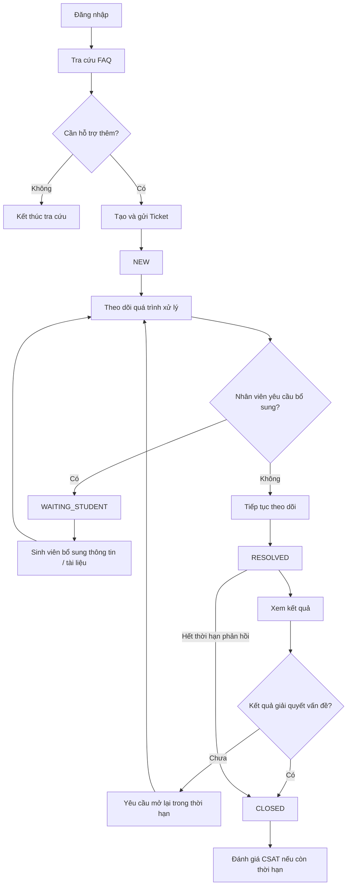

# M01 - Student Portal

## 1. Phạm Vi Phân Hệ

**Student Portal** cung cấp các chức năng để sinh viên Aurora University tra cứu hướng dẫn, tạo yêu cầu hỗ trợ, theo dõi quá trình xử lý và tương tác với các Ticket thuộc sở hữu của mình.

Phân hệ bao phủ toàn bộ hành trình của sinh viên từ khi xác định nhu cầu hỗ trợ đến khi nhận kết quả và đánh giá chất lượng dịch vụ.

## 2. Đối Tượng Và Phạm Vi Dữ Liệu

- **Đối tượng sử dụng:** Sinh viên (Student).
- **Phạm vi dữ liệu:** Sinh viên chỉ được xem và thao tác trên Ticket do chính tài khoản của mình tạo.
- **Điều kiện truy cập:** Các chức năng nghiệp vụ của Student Portal yêu cầu người dùng đã được xác thực bằng tài khoản hợp lệ.
- **Phạm vi quyền:** Sinh viên không được truy cập dữ liệu hoặc chức năng thuộc Staff Operations hoặc Management Dashboard.

## 3. Functional Requirements

| Mã FR | Yêu cầu chức năng |
| :--- | :--- |
| **FR-STU-00** | Đăng nhập và truy cập Student Portal |
| **FR-STU-01** | Tra cứu hướng dẫn và FAQ |
| **FR-STU-02** | Tạo và gửi yêu cầu hỗ trợ |
| **FR-STU-03** | Xem và theo dõi Ticket |
| **FR-STU-04** | Nhận và xem thông báo Ticket |
| **FR-STU-05** | Bổ sung thông tin và tài liệu |
| **FR-STU-06** | Xem kết quả, phản hồi và yêu cầu mở lại |
| **FR-STU-07** | Đánh giá mức độ hài lòng |

Chi tiết các yêu cầu chức năng được đặc tả tại [prd.md](./prd.md).

## 4. Luồng Nghiệp Vụ Chính

## 5. Quan Hệ Với Các Tài Liệu Khác

Student Portal sử dụng các quy tắc nghiệp vụ dùng chung đã được xác lập tại:

- [Ticket Lifecycle](../../02-domain/ticket-lifecycle.md)
- [State Transition](../../02-domain/state-transition.md)
- [Business Rules](../../02-domain/business-rules.md)

Các chi tiết triển khai kỹ thuật như API, cơ chế lưu phiên, cấu trúc database, mã lỗi hệ thống và thiết kế giao diện chi tiết được đặc tả ở các tài liệu kỹ thuật tương ứng.
