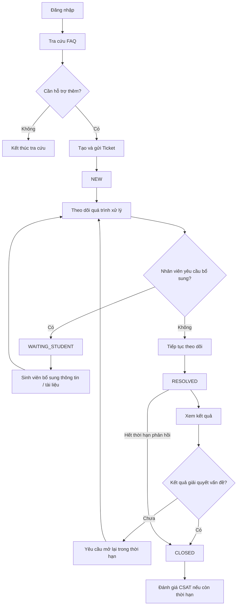

# M01 - Student Portal

## 1. Phạm Vi Phân Hệ

**Student Portal** cung cấp các chức năng để sinh viên Aurora University tra cứu hướng dẫn, tạo yêu cầu hỗ trợ, theo dõi quá trình xử lý và tương tác với Ticket thuộc sở hữu của mình.

Phân hệ bao phủ toàn bộ hành trình của sinh viên từ khi xác định nhu cầu hỗ trợ đến khi nhận kết quả và đánh giá chất lượng dịch vụ.

## 2. Đối Tượng Và Phạm Vi Dữ Liệu

- **Đối tượng sử dụng:** Sinh viên (Student).
- **Phạm vi dữ liệu:** Sinh viên chỉ được xem và thao tác trên Ticket do chính tài khoản của mình tạo.
- **Điều kiện truy cập:** Các chức năng nghiệp vụ của Student Portal yêu cầu người dùng đã được xác thực bằng tài khoản hợp lệ.

## 3. Work Packages

Tổng effort kế hoạch của M01 là **128 giờ**.

| Mã gói việc | Chức năng | Phạm vi nghiệp vụ | Effort |
| :--- | :--- | :--- | :---: |
| **WP-STU-01** | Tra cứu hướng dẫn & FAQ | Tra cứu FAQ và thông tin hướng dẫn trước khi tạo yêu cầu. | **14h** |
| **WP-STU-02** | Tạo & gửi yêu cầu hỗ trợ | Chọn nhóm vấn đề, mô tả yêu cầu, đính kèm minh chứng và tạo Ticket. | **37h** |
| **WP-STU-03** | Xem & theo dõi yêu cầu | Xem danh sách, chi tiết, trạng thái, đơn vị/người phụ trách và lịch sử xử lý. | **33h** |
| **WP-STU-04** | Nhận thông báo trạng thái | Nhận và xem thông báo liên quan đến các sự kiện quan trọng của Ticket. | **19h** |
| **WP-STU-05** | Bổ sung thông tin & phản hồi | Bổ sung thông tin/tài liệu, phản hồi kết quả, yêu cầu mở lại và đánh giá dịch vụ. | **25h** |
| **Tổng M01** |  |  | **128h** |

Xác thực đăng nhập là năng lực dùng chung của hệ thống. M01 sử dụng cơ chế xác thực chung và không tạo một cơ chế đăng nhập riêng cho Student Portal.

## 4. Functional Requirements

| Mã FR | Yêu cầu chức năng | Work Package |
| :--- | :--- | :--- |
| **FR-STU-00** | Đăng nhập và truy cập Student Portal | Shared Authentication |
| **FR-STU-01** | Tra cứu hướng dẫn & FAQ | WP-STU-01 |
| **FR-STU-02** | Tạo & gửi yêu cầu hỗ trợ | WP-STU-02 |
| **FR-STU-03** | Xem & theo dõi Ticket | WP-STU-03 |
| **FR-STU-04** | Nhận thông báo Ticket | WP-STU-04 |
| **FR-STU-05** | Bổ sung thông tin/tài liệu | WP-STU-05 |
| **FR-STU-06** | Xem kết quả, phản hồi và yêu cầu mở lại | WP-STU-05 |
| **FR-STU-07** | Đánh giá mức độ hài lòng | WP-STU-05 |

Chi tiết từng yêu cầu được đặc tả tại [prd.md](./prd.md).

## 5. Luồng Nghiệp Vụ Chính

Các chuyển đổi trạng thái và điều kiện chi tiết tuân thủ [Ticket Lifecycle](../../02-domain/ticket-lifecycle.md), [State Transition](../../02-domain/state-transition.md) và [Business Rules](../../02-domain/business-rules.md).
