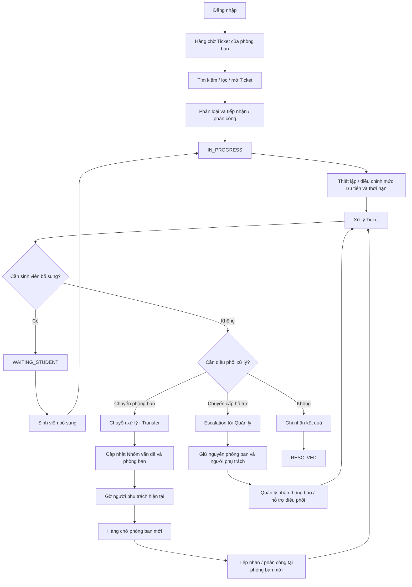

# M02 - Staff Operations

## 1. Phạm Vi Phân Hệ

**Staff Operations** là không gian làm việc dành cho nhân viên các phòng ban của Aurora University để tiếp nhận, phân loại, phân công, xử lý và theo dõi các Ticket hỗ trợ sinh viên.

Phân hệ tập trung vào hoạt động vận hành Ticket từ khi Ticket được đưa vào hàng chờ của phòng ban đến khi nhân viên ghi nhận kết quả ở `RESOLVED`. Ticket `RESOLVED`/`CLOSED` vẫn có thể được tra cứu trong phạm vi quyền; Ticket được mở lại hợp lệ sẽ quay về `IN_PROGRESS` để tiếp tục xử lý.

## 2. Đối Tượng Và Phạm Vi Dữ Liệu

- **Đối tượng sử dụng chính:** Nhân viên (Staff).
- **Phạm vi dữ liệu:** Nhân viên chỉ được xem và thao tác trên Ticket thuộc phòng ban/phạm vi trách nhiệm được cấp.
- **Người phụ trách:** Một Ticket có tối đa một người phụ trách chính tại một thời điểm. Ticket chưa được tiếp nhận/phân công hoặc vừa Transfer sang phòng ban mới có thể chưa có người phụ trách chính.
- **Phân công:** Chỉ người dùng có quyền phân công mới được gán hoặc phân công lại Ticket cho nhân viên phù hợp.
- **Điều kiện truy cập:** Người dùng phải đăng nhập bằng tài khoản hợp lệ và có quyền truy cập Staff Operations.

## 3. Functional Requirements

| Mã FR | Yêu cầu chức năng |
| :--- | :--- |
| **FR-STF-00** | Đăng nhập và truy cập Staff Operations |
| **FR-STF-01** | Xem hàng chờ, tìm kiếm và lọc Ticket |
| **FR-STF-02** | Phân loại, tiếp nhận và phân công Ticket |
| **FR-STF-03** | Quản lý mức độ ưu tiên và thời hạn xử lý |
| **FR-STF-04** | Xử lý Ticket và yêu cầu sinh viên bổ sung |
| **FR-STF-05** | Chuyển xử lý và Escalation |
| **FR-STF-06** | Ghi nhận kết quả và hoàn tất phần xử lý |

Chi tiết các yêu cầu chức năng được đặc tả tại [prd.md](./prd.md).

## 4. Luồng Nghiệp Vụ Chính

Sơ đồ trên mô tả **luồng nghiệp vụ chính** để thể hiện cách nhân viên xử lý Ticket. Đây không phải sơ đồ đầy đủ mọi khả năng chuyển trạng thái. Điều kiện cho phép Transfer và Escalation tại `NEW`, `IN_PROGRESS` hoặc `WAITING_STUDENT` được quy định chi tiết trong FR-STF-05 và các quy tắc Domain.

Ticket ở `RESOLVED` được đóng hoặc mở lại theo quy tắc vòng đời dùng chung. Khi được mở lại, Ticket quay về `IN_PROGRESS` và tiếp tục xuất hiện trong phạm vi xử lý phù hợp.

## 5. Quan Hệ Với Các Tài Liệu Khác

Staff Operations tuân thủ các quy tắc nghiệp vụ được xác lập tại:

- [Ticket Lifecycle](../../02-domain/ticket-lifecycle.md)
- [State Transition](../../02-domain/state-transition.md)
- [Business Rules](../../02-domain/business-rules.md)
