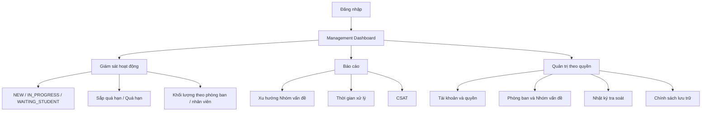

# M03 - Management Dashboard

## 1. Phạm Vi Phân Hệ

**Management Dashboard** là không gian làm việc dành cho người dùng Quản lý của Aurora University để giám sát hoạt động hỗ trợ sinh viên, xem báo cáo và thực hiện các chức năng quản trị được cấp quyền.

Phân hệ bao phủ hai nhóm chức năng chính:

- **Giám sát và báo cáo:** theo dõi tình trạng Ticket, khối lượng công việc, thời hạn xử lý, xu hướng nhóm vấn đề, thời gian xử lý và mức độ hài lòng.
- **Quản trị:** quản lý tài khoản/quyền, phòng ban, Nhóm vấn đề, chính sách lưu trữ và tra soát các thao tác quan trọng.

## 2. Đối Tượng Và Phạm Vi Dữ Liệu

- **Đối tượng sử dụng:** Quản lý (Management).
- **Phạm vi dữ liệu:** Người dùng chỉ xem và thao tác trên dữ liệu thuộc phạm vi quản lý được cấp.
- **Quyền quản trị:** Các chức năng thay đổi tài khoản, quyền, phòng ban, Nhóm vấn đề hoặc chính sách hệ thống chỉ được sử dụng khi tài khoản Management có quyền tương ứng.
- **Phạm vi Ticket:** Management có thể xem Ticket phục vụ giám sát/tra soát theo quyền nhưng không mặc định trở thành người phụ trách xử lý Ticket.
- **Vai trò hệ thống:** UniSupport chỉ có ba nhóm người dùng chính: Student, Staff và Management; không tạo thêm một nhóm người dùng Admin độc lập.

## 3. Functional Requirements

| Mã FR | Yêu cầu chức năng |
| :--- | :--- |
| **FR-MGT-00** | Đăng nhập và truy cập Management Dashboard |
| **FR-MGT-01** | Quản lý tài khoản, vai trò và phạm vi quyền |
| **FR-MGT-02** | Quản lý phòng ban và Nhóm vấn đề |
| **FR-MGT-03** | Tra soát lịch sử thao tác |
| **FR-MGT-04** | Quản lý chính sách lưu trữ dữ liệu |
| **FR-MGT-05** | Dashboard giám sát hoạt động hỗ trợ |
| **FR-MGT-06** | Báo cáo, CSAT và xuất dữ liệu |

Chi tiết các yêu cầu chức năng được đặc tả tại [prd.md](./prd.md).

## 4. Luồng Nghiệp Vụ Chính

## 5. Quan Hệ Với Các Tài Liệu Khác

Management Dashboard sử dụng các quy tắc dùng chung đã được xác lập tại:

- [Actors & Roles](../../01-product/actors-and-roles.md)
- [Ticket Model](../../02-domain/ticket-model.md)
- [Ticket Lifecycle](../../02-domain/ticket-lifecycle.md)
- [State Transition](../../02-domain/state-transition.md)
- [Business Rules](../../02-domain/business-rules.md)
