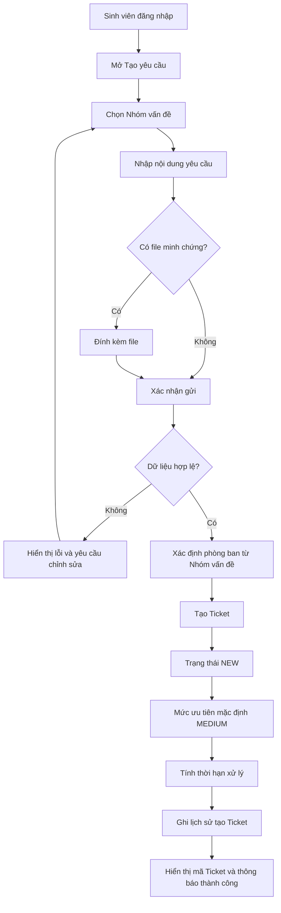

# WF-01 - Gửi Yêu Cầu Hỗ Trợ

## 1. Mục Đích Và Phạm Vi

Mô tả luồng từ khi sinh viên tạo yêu cầu đến khi hệ thống tạo Ticket thành công, xác định phòng ban tiếp nhận và trả mã Ticket cho sinh viên.

## 2. Sơ Đồ Nghiệp Vụ

## 3. Ghi Chú Nghiệp Vụ

- Sinh viên chỉ chọn Nhóm vấn đề đang hoạt động; không tự tạo hoặc nhập tự do.
- Nội dung yêu cầu từ 20 đến 2.000 ký tự.
- Tối đa 03 file/lần, 10 MB/file, PDF/PNG/JPG/JPEG.
- Một lần xác nhận gửi chỉ tạo tối đa một Ticket.
- Phòng ban tiếp nhận được xác định từ Nhóm vấn đề.

## 4. Tài Liệu Tham Chiếu

- M01: `FR-STU-02`, `FR-STU-04`.
- Domain: `BR-FILE-01`, `BR-FILE-02`, `BR-DUE-01`.
