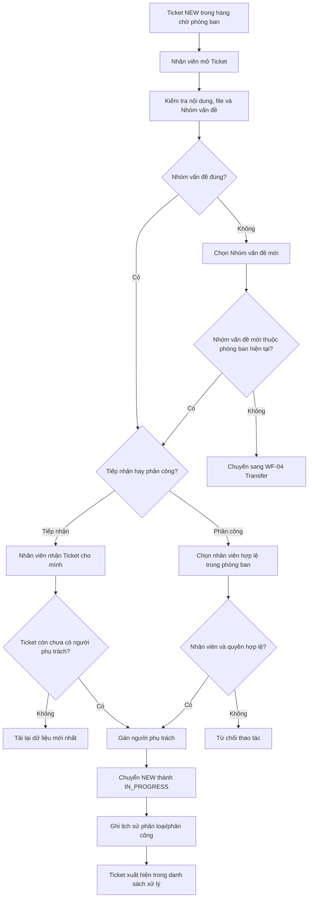

# WF-02 - Tiếp Nhận, Phân Loại Và Phân Công

## 1. Mục Đích Và Phạm Vi

Mô tả cách Ticket mới trong hàng chờ phòng ban được kiểm tra Nhóm vấn đề, tiếp nhận hoặc phân công cho một nhân viên và bắt đầu quá trình xử lý.

## 2. Sơ Đồ Nghiệp Vụ

## 3. Ghi Chú Nghiệp Vụ

- Một Ticket có tối đa một người phụ trách chính tại một thời điểm.
- Nhân viên được phân công phải đang hoạt động và thuộc phòng ban hiện tại.
- Nếu Nhóm vấn đề mới thuộc phòng ban khác, phải dùng WF-04; không lưu Category mới riêng lẻ.
- Mức độ ưu tiên và thời hạn tuân theo `BR-DUE-01` và `BR-DUE-02`.

## 4. Tài Liệu Tham Chiếu

- M02: `FR-STF-01`, `FR-STF-02`, `FR-STF-03`.
- Domain: `BR-OWN-01`, `BR-DUE-01`, `BR-DUE-02`.
