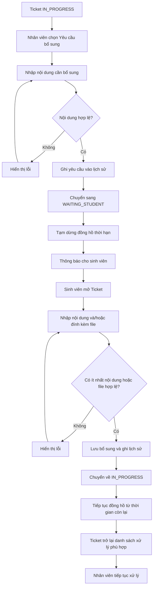

# WF-03 - Yêu Cầu Và Tiếp Nhận Bổ Sung

## 1. Mục Đích Và Phạm Vi

Mô tả luồng nhân viên yêu cầu sinh viên bổ sung thông tin/tài liệu và cách Ticket quay lại quá trình xử lý sau khi sinh viên phản hồi hợp lệ.

## 2. Sơ Đồ Nghiệp Vụ

## 3. Ghi Chú Nghiệp Vụ

- Yêu cầu bổ sung chỉ thực hiện khi Ticket ở `IN_PROGRESS`.
- Thời gian ở `WAITING_STUDENT` không tính vào thời gian xử lý.
- Sinh viên phải cung cấp ít nhất nội dung hoặc file.
- File bổ sung tuân thủ quy tắc file dùng chung.

## 4. Tài Liệu Tham Chiếu

- M01: `FR-STU-04`, `FR-STU-05`.
- M02: `FR-STF-04`.
- Domain: `BR-SUP-01`, `BR-FILE-02`, `BR-DUE-02`.
