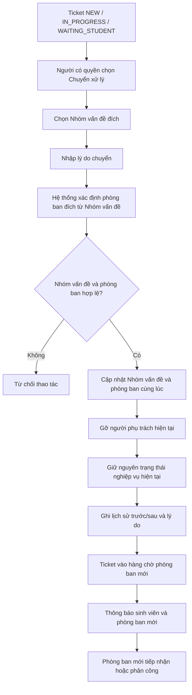

# WF-04 - Chuyển Xử Lý Sang Phòng Ban Khác

## 1. Mục Đích Và Phạm Vi

Mô tả cách Ticket được chuyển sang phòng ban khác khi nội dung thực tế thuộc phạm vi xử lý khác. Đổi người phụ trách trong cùng phòng ban không dùng Workflow này.

## 2. Sơ Đồ Nghiệp Vụ

## 3. Ghi Chú Nghiệp Vụ

- Transfer chỉ dùng khi chuyển sang **phòng ban khác**.
- Category đích phải đang hoạt động và ánh xạ tới phòng ban khác phòng ban hiện tại.
- Lý do chuyển từ 10 đến 1.000 ký tự.
- Transfer không tạo trạng thái mới và không tự đưa Ticket về `NEW`.
- Nội dung, file và toàn bộ lịch sử được giữ nguyên.

## 4. Tài Liệu Tham Chiếu

- M02: `FR-STF-05`.
- Domain: `BR-OWN-02`.
