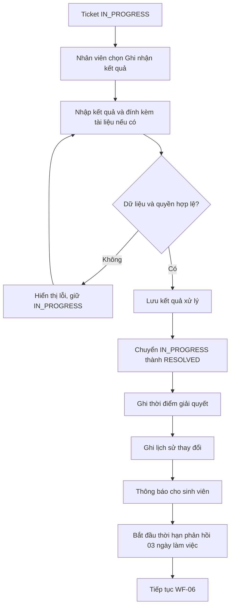

# WF-05 - Ghi Nhận Kết Quả Và Chuyển Sang RESOLVED

## 1. Mục Đích Và Phạm Vi

Mô tả bước nhân viên ghi nhận kết quả xử lý chính thức và đưa Ticket từ `IN_PROGRESS` sang `RESOLVED`. Workflow này không đóng Ticket.

## 2. Sơ Đồ Nghiệp Vụ

## 3. Ghi Chú Nghiệp Vụ

- Nội dung kết quả từ 20 đến 2.000 ký tự.
- Tài liệu kết quả tối đa 03 file/lần, 10 MB/file, PDF/PNG/JPG/JPEG.
- `RESOLVED` chưa phải trạng thái kết thúc vòng đời.
- Staff không có thao tác đóng Ticket độc lập.
- Đóng/mở lại sau `RESOLVED` được xử lý tại WF-06.

## 4. Tài Liệu Tham Chiếu

- M02: `FR-STF-06`.
- M01: `FR-STU-04`, `FR-STU-06`.
- Domain: `BR-LIFE-01`, `BR-FILE-01`, `BR-FILE-02`.
