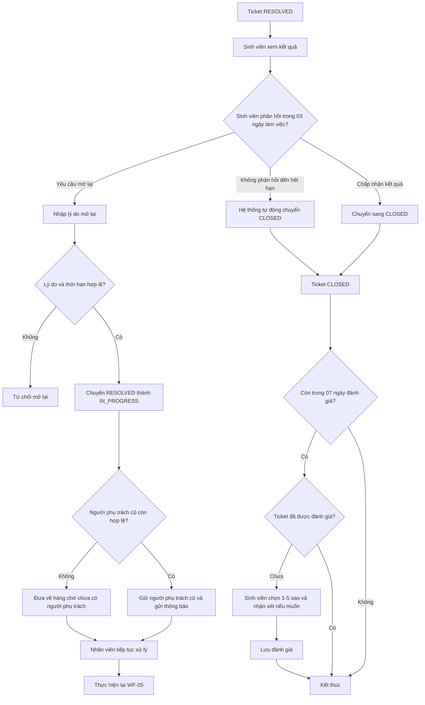

# WF-06 - Phản Hồi Kết Quả, Mở Lại, Đóng Và Đánh Giá

## 1. Mục Đích Và Phạm Vi

Mô tả toàn bộ hành vi sau khi Ticket ở `RESOLVED`: sinh viên chấp nhận kết quả hoặc yêu cầu mở lại; hệ thống tự đóng khi hết thời hạn; sau khi `CLOSED`, sinh viên có thể đánh giá mức độ hài lòng.

## 2. Sơ Đồ Nghiệp Vụ

## 3. Ghi Chú Nghiệp Vụ

- Reopen chỉ thực hiện từ `RESOLVED → IN_PROGRESS`.
- Staff không có thao tác đóng hoặc mở lại độc lập.
- `CLOSED` là trạng thái kết thúc vòng đời.
- Mỗi Ticket chỉ có tối đa một đánh giá.
- CSAT chỉ nhận trong 07 ngày theo lịch kể từ lúc Ticket `CLOSED`.
- Lịch sử/kết quả của các vòng xử lý trước phải được giữ nguyên.

## 4. Tài Liệu Tham Chiếu

- M01: `FR-STU-06`, `FR-STU-07`.
- M02: `FR-STF-01`, `FR-STF-06`.
- Domain: `BR-LIFE-02`, `BR-LIFE-03`, `BR-CSAT-01`.
