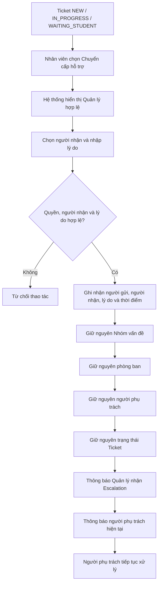

# WF-07 - Chuyển Cấp Hỗ Trợ (Escalation)

## 1. Mục Đích Và Phạm Vi

Mô tả cách nhân viên yêu cầu hỗ trợ từ Quản lý khi Ticket vượt thẩm quyền hiện tại, cần hỗ trợ điều phối hoặc có nguy cơ không đáp ứng thời hạn. Escalation không thay thế Transfer.

## 2. Sơ Đồ Nghiệp Vụ

## 3. Ghi Chú Nghiệp Vụ

- Escalation không đổi Category, phòng ban, assignee hoặc trạng thái.
- Sinh viên không nhận thông báo chỉ vì Escalation nội bộ.
- Nếu cần đổi phòng ban, sử dụng WF-04.
- Nếu cần đổi người phụ trách trong cùng phòng ban, sử dụng luồng phân công lại của M02.
- Lý do Escalation từ 10 đến 1.000 ký tự.

## 4. Tài Liệu Tham Chiếu

- M02: `FR-STF-05`.
- M03: phạm vi Quản lý và quyền liên quan.
- Domain: `BR-OWN-03`.
