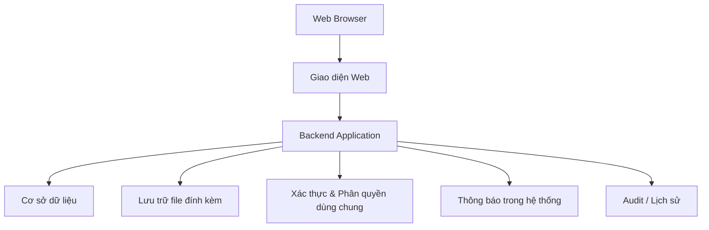

# ARC-02 - Kiến Trúc Tổng Quan

## 1. Mô Hình Tổng Quan

UniSupport sử dụng kiến trúc Web Application đơn giản với các lớp chính:

## 2. Giao Diện Web

Giao diện được tổ chức theo ba khu vực nghiệp vụ:
- Student Portal.
- Staff Operations.
- Management Dashboard.

Giao diện phải responsive trên máy tính và thiết bị di động, hỗ trợ Việt/Anh ở mức cơ bản.

## 3. Backend

Backend chịu trách nhiệm:
- thực thi Business Rules và Ticket Lifecycle;
- kiểm soát phạm vi dữ liệu theo vai trò/quyền;
- quản lý giao tiếp với dữ liệu và file;
- phát sinh thông báo nghiệp vụ;
- ghi lịch sử/Audit theo yêu cầu.

Các năng lực dùng chung không được coi là module nghiệp vụ độc lập.

## 4. Dữ Liệu

- Cơ sở dữ liệu lưu thông tin tài khoản, Ticket, Category, phòng ban, phân công, lịch sử, kết quả, đánh giá và cấu hình quản trị.
- File đính kèm được lưu tách khỏi dữ liệu văn bản nhưng phải liên kết đúng Ticket và kiểm soát quyền truy cập.
- Công nghệ database/file storage cụ thể được chọn ở giai đoạn triển khai kỹ thuật.

## 5. Triển Khai

Giải pháp triển khai phải phù hợp hạ tầng Aurora University cung cấp và nằm trong phạm vi hoạt động môi trường/CI-CD/triển khai/bàn giao của dự án.
