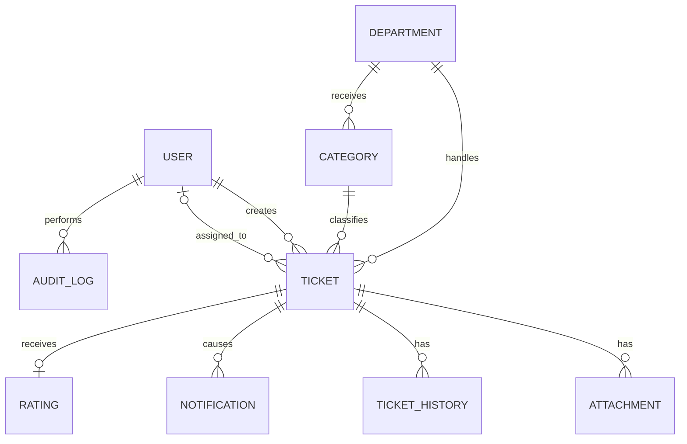

# ARC-04 - Mô Hình Dữ Liệu Logic

Tài liệu này mô tả các thực thể triển khai chính. Đây không thay thế Domain Model và không bắt buộc kiểu dữ liệu/database cụ thể.

## 1. Thực Thể Chính

| Thực thể | Mục đích |
| :--- | :--- |
| User | Tài khoản Sinh viên/Nhân viên/Quản lý và trạng thái hoạt động. |
| Department | Phòng ban tiếp nhận/xử lý Ticket. |
| Category | Nhóm vấn đề; Category hoạt động ánh xạ tới một phòng ban tiếp nhận. |
| Ticket | Yêu cầu hỗ trợ và trạng thái vòng đời hiện tại. |
| Attachment | File gắn với Ticket, bổ sung hoặc kết quả. |
| Ticket History | Lịch sử sự kiện nghiệp vụ của Ticket. |
| Notification | Thông báo trong hệ thống cho người dùng. |
| Rating | Đánh giá CSAT của Ticket đã CLOSED. |
| Audit Log | Dấu vết các thao tác quan trọng phục vụ tra soát. |
| Retention Policy | Cấu hình thời hạn lưu trữ cơ bản. |

## 2. Quan Hệ Cốt Lõi

## 3. Ràng Buộc Nghiệp Vụ Quan Trọng

- Ticket có tối đa một người phụ trách chính tại một thời điểm.
- Category/Department khi Transfer phải được cập nhật nhất quán.
- Rating tối đa một bản ghi/Ticket.
- Ticket chỉ dùng 5 state đã định nghĩa trong Domain.
- Audit và Ticket History phục vụ mục đích khác nhau và không được thay thế lẫn nhau.

Kiểu khóa chính, độ dài cột, index và chi tiết vật lý được quyết định khi thiết kế database.
