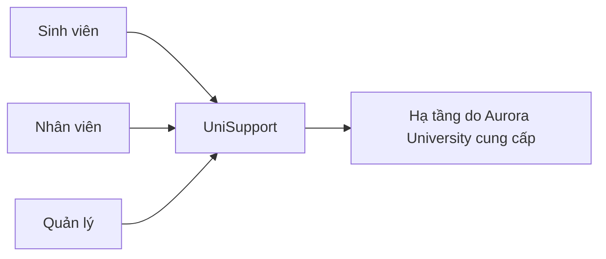

# ARC-01 - Ngữ Cảnh Hệ Thống

## 1. Ranh Giới

UniSupport là hệ thống Web Application độc lập của Aurora University, tập trung tiếp nhận, xử lý và theo dõi yêu cầu hỗ trợ sinh viên.

## 2. Actor

- **Sinh viên:** tạo Ticket, theo dõi, bổ sung, xem kết quả, mở lại trong điều kiện cho phép và đánh giá.
- **Nhân viên:** tiếp nhận, phân loại, phân công, xử lý, yêu cầu bổ sung, Transfer/Escalation và ghi nhận kết quả.
- **Quản lý:** giám sát, báo cáo, quản lý tài khoản/quyền, phòng ban/Category, Audit và chính sách lưu trữ.

## 3. Hệ Thống Bên Ngoài

UniSupport không phụ thuộc vào tích hợp hệ thống bên thứ ba trong phạm vi hiện tại. Hạ tầng máy chủ, tên miền và điều kiện mạng do Aurora University cung cấp.
